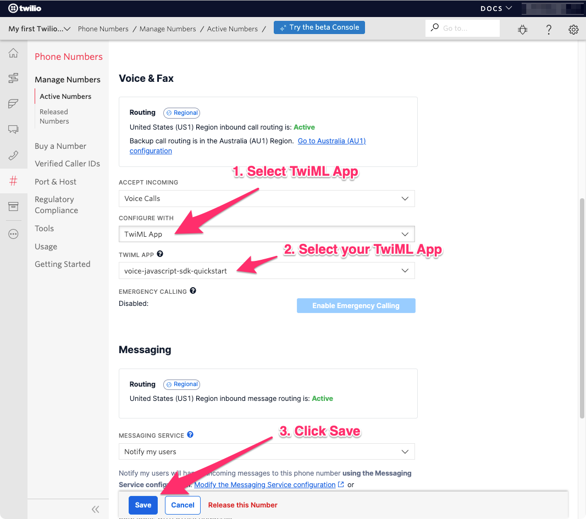

# Voicelink 📞

Voicelink is a lightweight web application built with Node.js and Twilio for making and receiving encrypted voice calls over the internet. With Voicelink, you can communicate securely without compromising your privacy.

 
<div style="display: flex; justify-content: center; margin-bottom: 20px;">
  
  
</div>


## Language and Dependencies


### JavaScript Libraries

- : Twilio's JavaScript SDK for voice calling functionality.
- : Web framework for Node.js, used for handling HTTP requests and routing.
- : Logging library for Node.js, used for error tracking and debugging.
- : JavaScript library for DOM manipulation and event handling.
- : jQuery plugin for international telephone input.


### CSS Frameworks

- **Bootstrap**: Front-end framework for styling and layout.
- **FontAwesome**: Icon library for adding icons to the user interface.

### HTML Templating

- **EJS**: Embedded JavaScript templates for generating HTML markup with JavaScript.

## Features

- **Secure Communication**: Utilizes Twilio's encrypted voice calling technology for secure communication.
- **Token-Based Authentication**: Generates JWT access tokens for authentication and authorization.
- **Dynamic Identity Generation**: Generates unique and dynamic identities for each user session.
- **Flexible Configuration**: Easily configurable with environment variables for API keys and other settings.
- **Logging and Monitoring**: Integrated logging with Winston for error tracking and debugging.

### Requirements

- [Nodejs](https://nodejs.org/) version **18.19.0** or above.
- [ngrok](https://ngrok.com/download) - this will be used to expose your local development server to the internet. For more information, read [this Twilio blog post](https://www.twilio.com/blog/2015/09/6-awesome-reasons-to-use-ngrok-when-testing-webhooks.html).
- A WebRTC enabled browser (Google Chrome or Mozilla Firefox are recommended). Edge and Internet Explorer will not work for testing.

### Create a TwiML Application, Purchase a Phone Number, Create an API Key

1. [Create a TwiML Application in the Twilio Console](https://www.twilio.com/console/voice/twiml/apps). Once you create the TwiML Application, click on it in your list of TwiML Apps to find the TwiML App SID. You will need this SID for your `.env` file. 

**Note:** You will need to configure the Voice "REQUEST URL" in your TwiML App later.

   - For detailed instructions with screenshots, see the [Create a TwiML App.md file](ConsoleHowTos/CreateNewTwiMLApp/CreateNewTwiMLApp.md)
 
2. [Purchase a Voice phone number](https://www.twilio.com/console/phone-numbers/incoming). You will need this phone number in [E.164 format](https://en.wikipedia.org/wiki/E.164) for your `.env` file.
   
   - For detailed instructions with screenshots, see the [Buy a Phone Number.md file](ConsoleHowTos/BuyVoicePhoneNumber/BuyVoicePhoneNumber.md)
   
3. [Create an API Key in the Twilio Console](https://www.twilio.com/console/project/api-keys). Keep the API Key SID and the API Secret in a safe place, since you will need them for your `.env` file. Your API KEY is needed to create an [Access Token](https://www.twilio.com/docs/iam/access-tokens).

   - For detailed instructions with screenshots, see the [Create an API Key.md file](ConsoleHowTos/CreateAPIKey/CreateAPIKey.md)

### Gather Config Values

Before we begin local development, we need to collect all the config values we need to run the application.

| Config Value                           | Description                                                                                                                                                              |
| :------------------------------------- | :----------------------------------------------------------------------------------------------------------------------------------------------------------------------- |
| `TWILIO_ACCOUNT_SID`                   | Your primary Twilio account identifier - find this [in the console here](https://www.twilio.com/console).                                                                |
| `TWILIO_TWIML_APP_SID`                 | The SID of the TwiML App you created in step 1 above. Find the SID [in the console here](https://www.twilio.com/console/voice/twiml/apps).                               |
| `TWILIO_CALLER_ID`                     | Your Twilio phone number in [E.164 format](https://en.wikipedia.org/wiki/E.164) - you can [find your number here](https://www.twilio.com/console/phone-numbers/incoming) |
| `TWILIO_API_KEY` / `TWILIO_API_SECRET` | The `TWILIO_API_KEY` is the API Key SID you created in step 3 above, and the `TWILIO_API_SECRET` is the secret associated with that key.                                 |

### Local development

1. Clone the repository: `git clone https://github.com/d10xi24/voicelink.git`
2. Install dependencies: `npm install`

4. Copy the `twilio.min.js` file from your `node_modules` to your `public` directory. Run the following from
   the root directory of your project: 

   ```bash
   cp node_modules/@twilio/voice-sdk/dist/twilio.min.js public/js/
   ```
   **Note:** In order to keep this quickstart as simple as possible, this step is used to avoid any need for build tools like Webpack.

3. Set up environment variables: Create a `.env` file based on `.env.example` and add your Twilio API keys.
4. Start the server: `npm start`
5. Access the application in your web browser: `http://localhost:1337`

6. Expose your application to the wider internet using `ngrok`. This step is **crucial** for the app to work as expected.

   ```bash
   ngrok http 1337
   ```

7. `ngrok` will assign a unique URL to your tunnel.
   It might be something like `https://asdf456.ngrok.io`. You will need this to configure your TwiML app in the next step.

8. Configure your TwiML app

   - In the Twilio Console, navigate to [Programmable Voice > TwiML > TwiML Apps](https://www.twilio.com/console/voice/twiml/apps)
   - Select the TwiML App you created earlier
   - On your TwiML App's information page, find the 'Voice Configuration' section.
   - Change the Request URL to your ngrok url with `/voice` appended to the end. (E.g: `https://asdf456.ngrok.io/voice`) **Note:** You **must** use the https URL, otherwise some browsers will block
     microphone access.
   - Click the 'Save' button.

   

You should now be ready to make and receive calls from your browser.


## Your Web Application

When you navigate to `localhost:1337`, the web application will automatically initialize the `Twilio.Device`.

Once the device is initialized, you can view a random "client name" assigned to you in the browser console. This client name serves as the `identity` field when generating an Access Token for the `Twilio.Device` and ensures that SDK-to-SDK calls are routed to the correct `Twilio.Device`.

### To make an outbound call to a phone number:

- Use the dropdown menu to select the country code, and the phone number input field will automatically be formatted to [E.164 format](https://en.wikipedia.org/wiki/E.164). Once you've entered the rest of the phone number, press the 'Call' button.

### To make a browser-to-browser call:

When you navigate to `localhost:1337`, the web application will automatically initialize the `Twilio.Device` in the browser window.

You should see a different client name displayed in the browser console for each window.

Enter one client's name into the other client's into the input field and press the 'Call' button.


### Receiving Incoming Calls from a Non-Browser Device

You will first need to configure your Twilio Voice Phone Number to use the TwiML App we created earlier. This tells Twilio how to handle an incoming call directed to your Twilio Voice Number.

1.  Log in to your [Twilio Console](https://www.twilio.com/console)
2.  Navigate to your [Active Numbers list](https://www.twilio.com/console/phone-numbers/incoming)
3.  Click on the number you purchased earlier
4.  Scroll down to find the 'Voice & Fax' section and look for 'CONFIGURE WITH'
5.  Select 'TwiML' App
6.  Under 'TWIML APP', choose the TwiML App you created earlier.
7.  Click the 'Save' button at the bottom of the browser window.



You can now call your Twilio Voice Phone Number from your cell or landline phone.

**Note:** Since this is a quickstart with limited functionality, incoming calls will only be routed to your most recently-created `Twilio.Device`.

### Unknown Audio Devices

If you see "Unknown Audio Output Device 1" in the "Ringtone" or "Speaker" devices lists, click the button below the boxes (Seeing "Unknown" Devices?) to have your browser identify your input and output devices.

## Running with Docker

You can also run Voicelink using Docker. Make sure you have Docker installed on your system. Follow these steps:

1. Pull the Docker image:
   ```bash
   sudo docker pull dion1evatine/voicelink:1.0.0
   ```

2. Run the Docker container:
   ```bash
   sudo docker run -p 1337:1337 dion1evatine/voicelink:1.0.0
   ```

3. Access the application in your web browser: `http://localhost:1337`

To stop the Docker container, you can use either the following methods:

- Find the container ID or name by running `sudo docker ps` and then stop the container using the `sudo docker stop` command followed by the container ID or name. For example:
  
  ```bash
  sudo docker ps
  ```
  Note the Container ID or Name of the voicelink container.
  ```bash
  sudo docker stop <container_id_or_name>
  ```

### Cloud deployment

In addition to trying out this application locally, you can deploy it to a variety of host services. Heroku is one option, linked below.

Please be aware that some of these services may charge you for the usage and/or might make the source code for this application visible to the public. When in doubt, research the respective hosting service first.

| Service                           |                                                                                     |
| :-------------------------------- | :---------------------------------------------------------------------------------- |
| [Heroku](https://www.heroku.com/) | [](https://heroku.com/deploy) |
| [Render](https://render.com/)     | Render supports hosting one free app. [Learn more](https://render.com/)             |
| [Amazon AWS](https://aws.amazon.com/) | Amazon AWS offers a 1-year free trial account. [Learn more](https://aws.amazon.com/free/) |
| [Google Cloud](https://cloud.google.com/) | Google Cloud provides $300 in free credits to new customers. [Learn more](https://cloud.google.com/free) |


## Contributing

Contributions are welcome! Please feel free to fork the repository, make changes, and submit a pull request. For major changes, please open an issue first to discuss the proposed changes.

## License

This project is licensed under the MIT License - see the [LICENSE](LICENSE) file for details.

## Acknowledgments

- [Twilio](https://www.twilio.com/) for providing the voice calling infrastructure.
- [Express](https://expressjs.com/) for the web framework.
- [Winston](https://github.com/winstonjs/winston) for the logging library.
- [jQuery](https://jquery.com/) for DOM manipulation and event handling.
- [intlTelInput](https://github.com/jackocnr/intl-tel-input) for international telephone input.

## Author

[dion@levatine](https://github.com/d10xi24)

## Disclaimer

No warranty expressed or implied. Software is as is.
